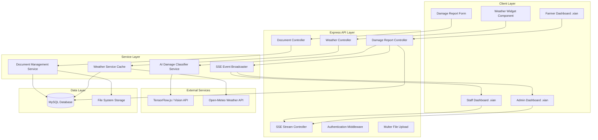

# Design Document: Farm Damage Assessment Feature

## Overview

This design specifies the implementation of four interconnected feature modules for the DA-AgriManage agricultural management system:

1. **AI-Powered Farm Damage Photo Assessment** — Automatic identification of crop damage type and severity from uploaded photos using computer vision AI/ML
2. **Land Title & Authorization Document Management** — Secure upload and storage of land ownership and tenant authorization documents
3. **Weather Condition Integration** — Real-time and forecast weather data display for barangay-level farm monitoring
4. **Real-time Damage Report Feed** — Server-sent events (SSE) for live damage report updates across staff and admin dashboards

These features extend the existing Node.js/Express + MySQL + `.xian` (Handlebars-based) template system used by DA-AgriManage, serving three roles: `farmer`, `staff`, and `admin`.

The design prioritizes:
- **Security**: Role-based access control, authenticated file uploads, SQL injection prevention
- **Performance**: Image compression, weather API caching, efficient SSE connection management
- **Reliability**: Graceful degradation when AI or weather services fail, automatic SSE reconnection
- **User Experience**: Real-time updates without page refresh, clear feedback on AI predictions

---

## Architecture

### High-Level Component Diagram



### Technology Stack

- **Backend**: Node.js 18+, Express.js 4.x
- **Database**: MySQL 8.0+ (via mysql2/promise connection pool)
- **Template Engine**: `.xian` (Handlebars-based custom engine)
- **AI/ML**: TensorFlow.js with pre-trained MobileNet model OR Google Cloud Vision API
- **Weather API**: Open-Meteo (free, no API key) with 30-minute server-side caching
- **File Uploads**: Multer middleware with disk storage
- **Real-time Updates**: Server-Sent Events (SSE) with EventSource on client
- **Authentication**: Express sessions stored in MySQL via express-mysql-session
- **File Storage**: Local file system with organized directory structure

---

## Components and Interfaces

### 1. AI Damage Classifier Service

**Responsibility**: Analyze uploaded farm damage photos and predict damage type and severity.

**Interface**:
```javascript
class AIDamageClassifierService {
  /**
   * Analyzes an uploaded image and returns damage predictions
   * @param {string} imagePath - Absolute path to uploaded image file
   * @param {string} farmerId - User ID of the farmer for audit logging
   * @param {GPSCoordinates} gpsCoords - GPS location from photo metadata or user device
   * @returns {Promise<DamagePrediction>}
   * @throws {AIAnalysisError} - If analysis fails or times out
   * @throws {NonCropImageError} - If image does not contain crops/farm
   * @throws {InvalidLocationError} - If GPS coordinates are outside farm area
   */
  async analyzeDamagePhoto(imagePath, farmerId, gpsCoords): Promise<DamagePrediction>
  
  /**
   * Validates image file before analysis
   * @param {Express.Multer.File} file - Uploaded file object
   * @returns {ValidationResult}
   */
  validateImageFile(file): ValidationResult
  
  /**
   * Pre-validates if image contains crops/agricultural content
   * @param {string} imagePath - Path to image file
   * @returns {Promise<CropDetectionResult>}
   */
  async detectCropsInImage(imagePath): Promise<CropDetectionResult>
  
  /**
   * Validates GPS coordinates against registered farm boundaries
   * @param {GPSCoordinates} coords - User's GPS coordinates
   * @param {string} farmerId - Farmer's user ID
   * @returns {Promise<LocationValidationResult>}
   */
  async validateFarmLocation(coords, farmerId): Promise<LocationValidationResult>
}

type DamagePrediction = {
  predictedDamageType: string;  // e.g., "Pest Infestation", "Flood", "Typhoon"
  confidenceScore: number;       // 0-100
  severityPercentage: number;    // 0-100 estimated damage percentage
  analysisTimestamp: Date;
  modelVersion: string;          // e.g., "mobilenet-v2-1.0"
  cropType?: string;             // Detected crop type (Rice, Corn, etc.)
  isCropDetected: boolean;       // TRUE if agricultural content detected
  gpsValidated: boolean;         // TRUE if GPS coordinates are within farm boundary
}

type ValidationResult = {
  isValid: boolean;
  error?: string;
  fileSize?: number;
  mimeType?: string;
}

type CropDetectionResult = {
  isCrop: boolean;               // TRUE if image contains crops/plants
  cropType?: string;             // Detected crop type
  confidence: number;            // 0-100 confidence that image is agricultural
  detectedObjects: string[];     // List of detected objects (e.g., ["person", "building"])
}

type GPSCoordinates = {
  latitude: number;
  longitude: number;
  accuracy?: number;             // GPS accuracy in meters
  timestamp?: Date;
}

type LocationValidationResult = {
  isValid: boolean;
  withinFarmBoundary: boolean;
  distanceFromFarm?: number;     // Distance in meters if outside farm
  errorMessage?: string;
}
```

**Implementation Strategy**:

**Step 1: Crop Detection (Pre-validation)**
- Before analyzing for damage, first check if image contains agricultural content
- Use **COCO-SSD** or **MobileNet** object detection to identify:
  - ✅ Agricultural objects: plants, crops, rice, corn, leaves, soil, farm field
  - ❌ Non-agricultural objects: person, face, building, car, furniture, indoor scenes
- If confidence of "agricultural content" < 60%, reject with error:
  - **Tagalog**: "Hindi ko ma-identify ang damage dahil ang larawan ay hindi tanim o bukid. Mangyaring kumuha ng larawan ng inyong pananim."
  - **English**: "Cannot identify damage. The image does not appear to be crops or farmland. Please upload a photo of your plants."

**Step 2: Crop Type Identification**
- After confirming the image contains crops, identify the specific crop type
- Use **MobileNet** or custom-trained model to classify:
  - 🌾 **Palay (Rice)** - Rice paddies, rice stalks, rice grains
  - 🌽 **Mais (Corn)** - Corn stalks, corn ears, corn leaves
  - 🍌 **Saging (Banana)** - Banana plants, banana leaves, banana bunches
  - 🥥 **Niyog (Coconut)** - Coconut trees, coconut palms, coconut fruits
  - 🥬 **Gulay (Vegetables)** - Tomato, eggplant, string beans, cabbage, lettuce, etc.
  - 🥭 **Prutas (Fruits)** - Mango, papaya, pineapple, citrus, etc.
  - 🌿 **Root Crops** - Sweet potato, cassava, taro, ginger
  - 🫘 **Legumes** - Mongo, peanuts, beans
  - 🌱 **Other crops** - Fallback for unrecognized crop types
- Confidence threshold: **70%** minimum to auto-fill crop type
- If confidence < 70%: show detected crop type with "(Not sure)" label, allow farmer to manually correct

**Step 3: GPS Location Validation**
- Require GPS coordinates from:
  - Photo EXIF data (latitude/longitude metadata)
  - Browser geolocation API (if photo has no GPS)
  - Manual override if GPS unavailable (with warning)
- Validate coordinates against farmer's registered farm boundary:
  - Query `farm_boundaries` table for farmer's lat/lon polygon
  - Check if photo GPS is within 500m radius of farm center
  - If outside boundary: show warning but allow submission with staff review flag

**Step 4: Damage Type Classification (Main AI Analysis)**

**Option A: TensorFlow.js with MobileNet (Recommended for MVP)**
- Use pre-trained MobileNet v2 model loaded via `@tensorflow/tfjs-node`
- Fine-tune on agricultural damage dataset or use transfer learning
- Image preprocessing: resize to 224x224, normalize pixel values
- **Crop type classification head**: Maps to 9 major crop types:
  1. Palay (Rice)
  2. Mais (Corn)
  3. Saging (Banana)
  4. Niyog (Coconut)
  5. Gulay (Vegetables)
  6. Prutas (Fruits)
  7. Root Crops (Sweet potato, cassava, taro)
  8. Legumes (Beans, peanuts)
  9. Other crops
- **Damage type classification head**: Maps to 7 damage types: Pest, Flood, Drought, Disease, Typhoon, Fire, Landslide
- Severity estimation from visual damage area percentage using segmentation
- Runs on server CPU/GPU, 2-5 second inference time per image

**Option B: Google Cloud Vision API (Cloud-dependent)**
- Use Cloud Vision API label detection + custom AutoML Vision model
- Higher accuracy but requires API key and incurs cost per request
- Fallback to TensorFlow.js if API quota exceeded

**Error Handling**:
- 15-second timeout enforced via `Promise.race()` with timeout reject
- If analysis fails: return `null` prediction, log error, allow manual entry
- Store analysis errors in `ai_analysis_log` table for debugging

**Security**:
- Only authenticated farmers can trigger analysis
- Rate limit: 10 requests per farmer per hour to prevent abuse
- Image files sanitized: strip EXIF GPS data for privacy

---

### 2. Document Management Service

**Responsibility**: Handle upload, storage, and retrieval of land title and authorization documents.

**Interface**:
```javascript
class DocumentManagementService {
  /**
   * Stores a land title document for a farmer
   * @param {Express.Multer.File} file - Uploaded file
   * @param {string} farmerId - Owner farmer ID
   * @returns {Promise<DocumentRecord>}
   */
  async storeLandTitleDocument(file, farmerId): Promise<DocumentRecord>
  
  /**
   * Stores an authorization letter for a tenant farmer
   * @param {Express.Multer.File} file - Uploaded file
   * @param {string} tenantFarmerId - Tenant farmer ID
   * @param {string} landOwnerId - Land owner ID (optional)
   * @returns {Promise<DocumentRecord>}
   */
  async storeAuthorizationLetter(file, tenantFarmerId, landOwnerId?): Promise<DocumentRecord>
  
  /**
   * Generates a pre-filled authorization letter template
   * @param {AuthLetterData} data - Farmer and land owner details
   * @returns {Promise<string>} - HTML content for PDF generation
   */
  async generateAuthorizationLetterTemplate(data: AuthLetterData): Promise<string>
  
  /**
   * Retrieves a document by ID (with access control)
   * @param {string} documentId - Document UUID
   * @param {string} requestingUserId - User requesting access
   * @param {string} requestingUserRole - Role of requesting user
   * @returns {Promise<DocumentRecord>}
   * @throws {AccessDeniedError} - If user lacks permission
   */
  async getDocument(documentId, requestingUserId, requestingUserRole): Promise<DocumentRecord>
}

type DocumentRecord = {
  id: string;                    // UUID
  farmerId: string;
  documentType: 'land_title' | 'authorization_letter';
  fileName: string;
  filePath: string;              // Relative path from uploads directory
  fileSizeBytes: number;
  mimeType: string;              // 'application/pdf', 'image/jpeg', 'image/png'
  uploadedAt: Date;
  associatedDamageReportId?: string;  // If uploaded with a damage report
  landOwnerId?: string;          // For authorization letters
  landOwnerName?: string;
}

type AuthLetterData = {
  tenantFarmerName: string;
  tenantFarmerId: string;
  tenantBarangay: string;
  landOwnerName: string;
  landOwnerContactNumber?: string;
  farmLocation?: string;
  currentDate: Date;
}
```

**File Storage Structure**:
```
uploads/
  land-titles/
    {farmerId}/
      {documentId}.pdf
      {documentId}.jpg
  authorization-letters/
    {tenantFarmerId}/
      {documentId}.pdf
```

**Security**:
- Files stored outside public web root (not in `/public`)
- Access controlled via `/api/documents/:id` endpoint with authentication
- Document access restricted to: owning farmer, staff, admin
- File paths stored in database as relative paths (no absolute paths)
- Filename sanitization: strip special characters, enforce allowed extensions

**Database Schema** (see Data Models section for full schema):
```sql
CREATE TABLE land_title_documents (
  id VARCHAR(255) PRIMARY KEY,
  farmerId VARCHAR(255) NOT NULL,
  fileName VARCHAR(500) NOT NULL,
  filePath VARCHAR(1000) NOT NULL,
  fileSizeBytes INT NOT NULL,
  mimeType VARCHAR(100) NOT NULL,
  uploadedAt TIMESTAMP DEFAULT CURRENT_TIMESTAMP,
  associatedDamageReportId VARCHAR(255),
  FOREIGN KEY (farmerId) REFERENCES users(id) ON DELETE CASCADE,
  INDEX idx_farmer (farmerId)
);

CREATE TABLE authorization_letters (
  id VARCHAR(255) PRIMARY KEY,
  tenantFarmerId VARCHAR(255) NOT NULL,
  landOwnerId VARCHAR(255),
  landOwnerName VARCHAR(255),
  fileName VARCHAR(500) NOT NULL,
  filePath VARCHAR(1000) NOT NULL,
  fileSizeBytes INT NOT NULL,
  mimeType VARCHAR(100) NOT NULL,
  uploadedAt TIMESTAMP DEFAULT CURRENT_TIMESTAMP,
  associatedDamageReportId VARCHAR(255),
  FOREIGN KEY (tenantFarmerId) REFERENCES users(id) ON DELETE CASCADE,
  INDEX idx_tenant (tenantFarmerId)
);
```

---

### 3. Weather Service

**Responsibility**: Fetch, cache, and serve weather data for barangays.

**Interface**:
```javascript
class WeatherService {
  /**
   * Retrieves current and forecast weather for a barangay
   * @param {string} barangay - Barangay name
   * @returns {Promise<WeatherData>}
   */
  async getWeatherForBarangay(barangay): Promise<WeatherData>
  
  /**
   * Retrieves historical weather for a specific date (if available)
   * @param {string} barangay - Barangay name
   * @param {Date} date - Target date
   * @returns {Promise<HistoricalWeatherData | null>}
   */
  async getHistoricalWeather(barangay, date): Promise<HistoricalWeatherData | null>
  
  /**
   * Invalidates cache for a barangay (force refresh)
   * @param {string} barangay - Barangay name
   */
  invalidateCache(barangay): void
}

type WeatherData = {
  barangay: string;
  currentConditions: {
    temperature: number;         // Celsius
    feelsLike: number;
    humidity: number;            // Percentage
    windSpeed: number;           // km/h
    windDirection: string;       // e.g., "NE"
    precipitation: number;       // mm
    weatherCode: number;         // WMO weather code
    weatherDescription: string;  // e.g., "Partly Cloudy"
    timestamp: Date;
  };
  forecast: Array<{
    date: Date;
    maxTemp: number;
    minTemp: number;
    precipitationChance: number; // Percentage
    weatherCode: number;
    weatherDescription: string;
  }>;  // 3-day forecast
  lastUpdated: Date;
  cacheExpiry: Date;
}

type HistoricalWeatherData = {
  date: Date;
  avgTemperature: number;
  precipitation: number;
  maxWindSpeed: number;
  weatherDescription: string;
}
```

**Implementation Details**:

**Weather API Selection**: Open-Meteo (https://open-meteo.com)
- Free, no API key required, 10,000 requests/day limit
- Provides current, forecast, and historical weather data
- Endpoints:
  - Current + Forecast: `https://api.open-meteo.com/v1/forecast?latitude={lat}&longitude={lon}&current=temperature_2m,relative_humidity_2m,precipitation,wind_speed_10m&daily=temperature_2m_max,temperature_2m_min,precipitation_sum&timezone=Asia/Manila`
  - Historical: `https://archive-api.open-meteo.com/v1/archive?latitude={lat}&longitude={lon}&start_date={date}&end_date={date}`

**Barangay to Coordinates Mapping**:
- Maintain a `barangay_coordinates` MySQL table mapping barangay names to lat/lon
- Pre-populate table with coordinates for all barangays in the system
- Format: `{ barangay: "Pag-asa", municipality: "Victoria", latitude: 13.1234, longitude: 121.2345 }`

**Caching Strategy**:
- Cache weather data in MySQL `weather_cache` table for 30 minutes per barangay
- Check cache first; if fresh (<30 min old), return cached data
- If stale, fetch from API, update cache, return fresh data
- Cache key: `barangay-{barangayName}`

**Error Handling**:
- If API call fails: return cached data even if expired (stale-while-revalidate)
- If no cached data and API fails: return `null`, display fallback UI message
- Log all API errors for monitoring

**Database Schema**:
```sql
CREATE TABLE barangay_coordinates (
  barangay VARCHAR(255) PRIMARY KEY,
  municipality VARCHAR(255) NOT NULL,
  latitude DECIMAL(10, 7) NOT NULL,
  longitude DECIMAL(10, 7) NOT NULL,
  INDEX idx_municipality (municipality)
);

CREATE TABLE weather_cache (
  barangay VARCHAR(255) PRIMARY KEY,
  weatherData JSON NOT NULL,
  fetchedAt TIMESTAMP DEFAULT CURRENT_TIMESTAMP,
  expiresAt TIMESTAMP NOT NULL,
  INDEX idx_expiry (expiresAt)
);
```

---

### 4. SSE Event Broadcaster

**Responsibility**: Manage real-time server-sent event connections for damage report updates.

**Interface**:
```javascript
class SSEEventBroadcaster {
  /**
   * Registers a new SSE client connection
   * @param {string} userId - Connected user ID
   * @param {string} userRole - User role ('staff' | 'admin')
   * @param {Response} res - Express response object
   */
  registerClient(userId, userRole, res): void
  
  /**
   * Removes a disconnected client
   * @param {string} userId - Disconnected user ID
   */
  unregisterClient(userId): void
  
  /**
   * Broadcasts a new damage report event to all staff/admin clients
   * @param {DamageReport} report - New damage report data
   */
  broadcastNewReport(report): void
  
  /**
   * Broadcasts a damage report status update event
   * @param {string} reportId - Report ID
   * @param {string} newStatus - Updated status
   * @param {string} verifiedBy - Staff/admin user who updated
   */
  broadcastReportUpdate(reportId, newStatus, verifiedBy): void
  
  /**
   * Sends heartbeat to all clients (keep-alive)
   */
  sendHeartbeat(): void
}
```

**Implementation Details**:

**SSE Endpoint**: `GET /api/damage-reports/stream`
- Authenticated endpoint (requires `req.session.userId`)
- Restricted to `staff` and `admin` roles (HTTP 403 for farmers)
- Sets headers: `Content-Type: text/event-stream`, `Cache-Control: no-cache`, `Connection: keep-alive`

**Event Format**:
```
event: new_damage_report
data: {"id":"DMG-1234567890","farmerId":"USER-123","farmerName":"Juan Dela Cruz","barangay":"Pag-asa","disasterType":"Typhoon","cropType":"Rice","damagePercentage":75,"status":"pending","createdAt":"2025-06-15T10:30:00.000Z"}

event: update_damage_report
data: {"id":"DMG-1234567890","status":"verified","verifiedBy":"STAFF-456","verifiedAt":"2025-06-15T11:00:00.000Z"}

event: heartbeat
data: {"timestamp":"2025-06-15T11:00:30.000Z"}
```

**Client Connection Management**:
- Store active clients in a `Map<userId, Response>` in-memory (scoped to server instance)
- On client disconnect (connection closed): remove from map
- Heartbeat every 30 seconds to detect dead connections
- On damage report submission: call `broadcastNewReport()` after MySQL INSERT

**Client-Side Reconnection**:
```javascript
// Client JavaScript (in .xian template)
let eventSource;

function connectSSE() {
  eventSource = new EventSource('/api/damage-reports/stream');
  
  eventSource.addEventListener('new_damage_report', (e) => {
    const report = JSON.parse(e.data);
    prependReportToTable(report);
  });
  
  eventSource.addEventListener('update_damage_report', (e) => {
    const update = JSON.parse(e.data);
    updateReportInTable(update);
  });
  
  eventSource.onerror = () => {
    console.log('SSE connection lost, reconnecting in 5s...');
    eventSource.close();
    setTimeout(connectSSE, 5000);
  };
}

connectSSE();
```

**Scalability Note**:
- This in-memory approach works for single-server deployments
- For multi-server/Vercel deployments: use Redis Pub/Sub to broadcast events across instances
- Redis alternative: each server instance maintains its own SSE clients, and damage report controller publishes to Redis channel, which all servers subscribe to

---

## Data Models

### Existing Table Extensions

**1. Extend `damage_reports` table** (add AI prediction columns):
```sql
ALTER TABLE damage_reports
ADD COLUMN aiPredictedDamageType VARCHAR(100) AFTER evidenceImages,
ADD COLUMN aiConfidenceScore DECIMAL(5, 2) AFTER aiPredictedDamageType,
ADD COLUMN aiAnalysisTimestamp TIMESTAMP NULL AFTER aiConfidenceScore,
ADD COLUMN photoFilePath VARCHAR(1000) AFTER aiAnalysisTimestamp,
ADD INDEX idx_ai_predicted (aiPredictedDamageType);
```

**Field Descriptions**:
- `aiPredictedDamageType`: AI-predicted disaster type (e.g., "Pest Infestation")
- `aiConfidenceScore`: AI confidence (0-100)
- `aiAnalysisTimestamp`: When AI analysis completed
- `photoFilePath`: Path to uploaded damage photo

**2. Extend `users` table** (add tenant flag):
```sql
ALTER TABLE users
ADD COLUMN isTenant BOOLEAN DEFAULT FALSE AFTER barangay,
ADD COLUMN landOwnerId VARCHAR(255) AFTER isTenant,
ADD COLUMN landOwnerName VARCHAR(255) AFTER landOwnerId,
ADD INDEX idx_tenant (isTenant);
```

### New Tables

**3. `land_title_documents` table**:
```sql
CREATE TABLE IF NOT EXISTS land_title_documents (
  id VARCHAR(255) PRIMARY KEY,
  farmerId VARCHAR(255) NOT NULL,
  fileName VARCHAR(500) NOT NULL,
  filePath VARCHAR(1000) NOT NULL,
  fileSizeBytes INT NOT NULL,
  mimeType VARCHAR(100) NOT NULL,
  uploadedAt TIMESTAMP DEFAULT CURRENT_TIMESTAMP,
  associatedDamageReportId VARCHAR(255),
  FOREIGN KEY (farmerId) REFERENCES users(id) ON DELETE CASCADE,
  INDEX idx_farmer (farmerId),
  INDEX idx_damage_report (associatedDamageReportId)
) ENGINE=InnoDB DEFAULT CHARSET=utf8mb4 COLLATE=utf8mb4_unicode_ci;
```

**4. `authorization_letters` table**:
```sql
CREATE TABLE IF NOT EXISTS authorization_letters (
  id VARCHAR(255) PRIMARY KEY,
  tenantFarmerId VARCHAR(255) NOT NULL,
  landOwnerId VARCHAR(255),
  landOwnerName VARCHAR(255),
  fileName VARCHAR(500) NOT NULL,
  filePath VARCHAR(1000) NOT NULL,
  fileSizeBytes INT NOT NULL,
  mimeType VARCHAR(100) NOT NULL,
  uploadedAt TIMESTAMP DEFAULT CURRENT_TIMESTAMP,
  associatedDamageReportId VARCHAR(255),
  FOREIGN KEY (tenantFarmerId) REFERENCES users(id) ON DELETE CASCADE,
  INDEX idx_tenant (tenantFarmerId),
  INDEX idx_damage_report (associatedDamageReportId)
) ENGINE=InnoDB DEFAULT CHARSET=utf8mb4 COLLATE=utf8mb4_unicode_ci;
```

**5. `barangay_coordinates` table**:
```sql
CREATE TABLE IF NOT EXISTS barangay_coordinates (
  barangay VARCHAR(255) PRIMARY KEY,
  municipality VARCHAR(255) NOT NULL,
  province VARCHAR(255) NOT NULL DEFAULT 'Oriental Mindoro',
  latitude DECIMAL(10, 7) NOT NULL,
  longitude DECIMAL(10, 7) NOT NULL,
  INDEX idx_municipality (municipality)
) ENGINE=InnoDB DEFAULT CHARSET=utf8mb4 COLLATE=utf8mb4_unicode_ci;
```

**6. `weather_cache` table**:
```sql
CREATE TABLE IF NOT EXISTS weather_cache (
  barangay VARCHAR(255) PRIMARY KEY,
  weatherData JSON NOT NULL,
  fetchedAt TIMESTAMP DEFAULT CURRENT_TIMESTAMP,
  expiresAt TIMESTAMP NOT NULL,
  INDEX idx_expiry (expiresAt)
) ENGINE=InnoDB DEFAULT CHARSET=utf8mb4 COLLATE=utf8mb4_unicode_ci;
```

**7. `ai_analysis_log` table** (for debugging/auditing):
```sql
CREATE TABLE IF NOT EXISTS ai_analysis_log (
  id VARCHAR(255) PRIMARY KEY,
  farmerId VARCHAR(255) NOT NULL,
  damageReportId VARCHAR(255),
  imageFilePath VARCHAR(1000) NOT NULL,
  predictedDamageType VARCHAR(100),
  predictedCropType VARCHAR(100),
  confidenceScore DECIMAL(5, 2),
  severityPercentage DECIMAL(5, 2),
  isCropDetected BOOLEAN DEFAULT TRUE,
  cropDetectionConfidence DECIMAL(5, 2),
  gpsLatitude DECIMAL(10, 7),
  gpsLongitude DECIMAL(10, 7),
  gpsValidated BOOLEAN DEFAULT FALSE,
  gpsAccuracyMeters INT,
  analysisSuccess BOOLEAN NOT NULL,
  errorMessage TEXT,
  processingTimeMs INT,
  modelVersion VARCHAR(100),
  createdAt TIMESTAMP DEFAULT CURRENT_TIMESTAMP,
  FOREIGN KEY (farmerId) REFERENCES users(id) ON DELETE CASCADE,
  INDEX idx_farmer (farmerId),
  INDEX idx_success (analysisSuccess),
  INDEX idx_created (createdAt),
  INDEX idx_crop_detected (isCropDetected)
) ENGINE=InnoDB DEFAULT CHARSET=utf8mb4 COLLATE=utf8mb4_unicode_ci;
```

**8. `farm_boundaries` table** (for GPS location validation):
```sql
CREATE TABLE IF NOT EXISTS farm_boundaries (
  id VARCHAR(255) PRIMARY KEY,
  farmerId VARCHAR(255) NOT NULL,
  farmName VARCHAR(500),
  centerLatitude DECIMAL(10, 7) NOT NULL,
  centerLongitude DECIMAL(10, 7) NOT NULL,
  radiusMeters INT NOT NULL DEFAULT 500,
  boundaryPolygon JSON,
  barangay VARCHAR(255) NOT NULL,
  landArea DECIMAL(10, 2),
  createdAt TIMESTAMP DEFAULT CURRENT_TIMESTAMP,
  updatedAt TIMESTAMP DEFAULT CURRENT_TIMESTAMP ON UPDATE CURRENT_TIMESTAMP,
  FOREIGN KEY (farmerId) REFERENCES users(id) ON DELETE CASCADE,
  INDEX idx_farmer (farmerId),
  INDEX idx_barangay (barangay),
  SPATIAL INDEX idx_location (centerLatitude, centerLongitude)
) ENGINE=InnoDB DEFAULT CHARSET=utf8mb4 COLLATE=utf8mb4_unicode_ci;
```

---

## API Endpoints

### 1. AI Damage Assessment Endpoints

**POST `/api/damage-reports/analyze-photo`**
- **Auth**: Required (farmer role)
- **Content-Type**: `multipart/form-data`
- **Body**:
  - `photo`: File (JPEG/PNG/WEBP, max 5MB)
  - `latitude`: Number (optional, from device GPS)
  - `longitude`: Number (optional, from device GPS)
  - `gpsAccuracy`: Number (optional, GPS accuracy in meters)
- **Response** (200):
  ```json
  {
    "success": true,
    "prediction": {
      "predictedDamageType": "Pest Infestation",
      "predictedCropType": "Rice",
      "confidenceScore": 87.5,
      "severityPercentage": 65,
      "isCropDetected": true,
      "cropDetectionConfidence": 92.0,
      "gpsValidated": true,
      "analysisTimestamp": "2025-06-15T10:30:00.000Z"
    },
    "photoFilePath": "uploads/damage-photos/USER-123/DMG-1234567890.jpg",
    "location": {
      "latitude": 12.768264,
      "longitude": 121.464061,
      "withinFarmBoundary": true
    }
  }
  ```
- **Response** (400): 
  - Validation error (file too large, invalid format)
  - Non-crop image detected:
    ```json
    {
      "success": false,
      "error": "NON_CROP_IMAGE",
      "message": "Hindi ko ma-identify ang damage dahil ang larawan ay hindi tanim o bukid. Mangyaring kumuha ng larawan ng inyong pananim.",
      "detectedObjects": ["person", "indoor"]
    }
    ```
  - GPS location outside farm:
    ```json
    {
      "success": false,
      "error": "LOCATION_MISMATCH",
      "message": "Ang lokasyon ng larawan ay malayo sa inyong rehistradong sakahan. Mangyaring mag-upload ng larawan mula sa inyong farm.",
      "distanceFromFarm": 1500,
      "requiresStaffReview": true
    }
    ```
- **Response** (500): AI analysis failed or timeout
- **Rate Limit**: 10 requests per hour per farmer

---

### 2. Document Management Endpoints

**POST `/api/documents/land-title`**
- **Auth**: Required (farmer role)
- **Content-Type**: `multipart/form-data`
- **Body**:
  - `document`: File (PDF/JPEG/PNG, max 10MB)
  - `associatedDamageReportId`: String (optional)
- **Response** (200):
  ```json
  {
    "success": true,
    "document": {
      "id": "LT-1234567890",
      "farmerId": "USER-123",
      "fileName": "land-title-juan-dela-cruz.pdf",
      "uploadedAt": "2025-06-15T10:30:00.000Z"
    }
  }
  ```

**POST `/api/documents/authorization-letter`**
- **Auth**: Required (farmer role with `isTenant=true`)
- **Content-Type**: `multipart/form-data`
- **Body**:
  - `document`: File (PDF/JPEG/PNG, max 10MB)
  - `landOwnerName`: String
  - `landOwnerId`: String (optional)
  - `associatedDamageReportId`: String (optional)
- **Response** (200): Similar to land-title endpoint

**POST `/api/documents/generate-authorization-letter`**
- **Auth**: Required (farmer role with `isTenant=true`)
- **Content-Type**: `application/json`
- **Body**:
  ```json
  {
    "landOwnerName": "Maria Santos",
    "landOwnerContactNumber": "09123456789",
    "farmLocation": "Sitio Maligaya, Brgy. Pag-asa"
  }
  ```
- **Response** (200): HTML content for PDF generation/download

**GET `/api/documents/:documentId`**
- **Auth**: Required (farmer/staff/admin)
- **Access Control**: Only owner, staff, or admin can retrieve
- **Response** (200): File stream (PDF/image)
- **Response** (403): Access denied

---

### 3. Weather Service Endpoints

**GET `/api/weather/:barangay`**
- **Auth**: Required (any role)
- **Response** (200):
  ```json
  {
    "success": true,
    "weather": {
      "barangay": "Pag-asa",
      "currentConditions": {
        "temperature": 28.5,
        "feelsLike": 32.0,
        "humidity": 75,
        "windSpeed": 15,
        "windDirection": "NE",
        "precipitation": 2.5,
        "weatherDescription": "Partly Cloudy",
        "timestamp": "2025-06-15T10:30:00.000Z"
      },
      "forecast": [
        {
          "date": "2025-06-16",
          "maxTemp": 32,
          "minTemp": 24,
          "precipitationChance": 40,
          "weatherDescription": "Scattered Showers"
        }
      ],
      "lastUpdated": "2025-06-15T10:00:00.000Z"
    }
  }
  ```
- **Response** (404): Barangay coordinates not found
- **Response** (503): Weather API unavailable, fallback message

**GET `/api/weather/historical/:barangay/:date`**
- **Auth**: Required (any role)
- **Date Format**: `YYYY-MM-DD`
- **Response** (200): Historical weather data for the date
- **Response** (404): No data available for that date

---

### 4. SSE Real-time Feed Endpoints

**GET `/api/damage-reports/stream`**
- **Auth**: Required (staff or admin role only)
- **Response Headers**:
  - `Content-Type: text/event-stream`
  - `Cache-Control: no-cache`
  - `Connection: keep-alive`
- **Events**:
  - `new_damage_report`: Sent when farmer submits new report
  - `update_damage_report`: Sent when staff/admin verifies or rejects
  - `heartbeat`: Sent every 30 seconds
- **Connection Management**: Auto-reconnect on client if dropped

---

## Error Handling

### AI Analysis Errors

| Error Condition | Response | User Impact |
|----------------|----------|-------------|
| File size > 5MB | HTTP 400: "File too large" | Shows validation error, user must compress image |
| Invalid file type | HTTP 400: "Invalid file format" | Shows error, user must upload JPEG/PNG/WEBP |
| AI timeout (>15s) | HTTP 500: "Analysis timed out" | Shows error, fields remain editable for manual entry |
| AI model crash | HTTP 500: "Analysis failed" | Logs error, allows manual entry, notifies admin |
| Rate limit exceeded | HTTP 429: "Too many requests" | Shows cooldown message, try again in X minutes |

**Fallback Behavior**: If AI analysis fails, the damage report form remains fully functional with manual dropdown selection for `disasterType` and manual input for `damagePercentage`.

### Document Upload Errors

| Error Condition | Response | User Impact |
|----------------|----------|-------------|
| File size > 10MB | HTTP 400: "File too large" | Shows error, user must reduce file size |
| Invalid file type | HTTP 400: "Invalid document format" | Shows error, user must upload PDF/JPEG/PNG |
| Disk write failure | HTTP 500: "Upload failed" | Shows error, retries on user action, logs to admin |
| Duplicate upload | HTTP 409: "Document already exists" | Shows warning, offers to replace or keep existing |

### Weather API Errors

| Error Condition | Response | User Impact |
|----------------|----------|-------------|
| API timeout (>10s) | Return cached data (stale) | Widget shows cached data with "Last updated" timestamp |
| API down (no response) | Return cached or null | Shows "Weather data unavailable" fallback message |
| Rate limit exceeded | Return cached data | Uses stale cache, refreshes after 30min |
| Barangay not found | HTTP 404 | Shows "Coordinates not available for this barangay" |

### SSE Connection Errors

| Error Condition | Handling | User Impact |
|----------------|---------|-------------|
| Client disconnects | Remove from active clients map | Clean disconnect, no error |
| Server restart | All clients disconnect | Clients auto-reconnect after 5s |
| Network interruption | EventSource auto-reconnects | Transparent reconnection |
| Authentication expires | Closes connection with 401 | User redirected to login |

---

## Testing Strategy

This feature combines UI interactions, external service integration, file uploads, and real-time communication. The testing strategy employs both unit tests and integration tests to ensure correctness without over-reliance on property-based testing (PBT is not appropriate for UI rendering, external API calls, or file upload workflows).

### Unit Testing

**AI Damage Classifier Service**:
- **Test image validation**: 
  - Valid file formats (JPEG, PNG, WEBP) pass validation
  - Invalid formats (GIF, BMP, TIFF) are rejected
  - Files exceeding 5MB are rejected
  - Files under size limit are accepted
- **Test AI prediction parsing**:
  - Mock TensorFlow.js output with known predictions, verify correct damage type mapping
  - Test confidence score conversion to percentage
  - Test severity percentage extraction from model output
- **Test error handling**:
  - Simulate model timeout, verify graceful failure
  - Simulate model crash exception, verify error logging and null return
  - Simulate malformed model output, verify fallback to null

**Document Management Service**:
- **Test file storage**:
  - Verify correct directory structure creation (`uploads/land-titles/{farmerId}/`)
  - Verify filename sanitization (special characters removed)
  - Verify file path stored as relative, not absolute
- **Test access control**:
  - Owner farmer can access their own documents
  - Staff and admin can access any farmer's documents
  - Non-owner farmer receives 403 error
  - Unauthenticated requests receive 401 error
- **Test authorization letter generation**:
  - Verify HTML template renders with correct farmer/landowner names
  - Verify current date is included
  - Verify template fields are properly escaped (XSS prevention)

**Weather Service**:
- **Test caching logic**:
  - Fresh cache (<30min old) returns cached data without API call
  - Stale cache (>30min old) triggers API fetch and cache update
  - Cache miss triggers API fetch and cache insert
- **Test coordinate lookup**:
  - Known barangay returns correct lat/lon from database
  - Unknown barangay returns null or error
- **Test error handling**:
  - API timeout returns stale cached data if available
  - API error with no cache returns null
  - Rate limit exceeded returns cached data

**SSE Event Broadcaster**:
- **Test client registration**:
  - Staff role successfully registers SSE connection
  - Admin role successfully registers SSE connection
  - Farmer role receives 403 error
  - Unauthenticated request receives 401 error
- **Test event broadcasting**:
  - New damage report triggers `new_damage_report` event to all connected staff/admin clients
  - Report status update triggers `update_damage_report` event
  - Heartbeat sent every 30 seconds to all clients
- **Test client cleanup**:
  - Disconnected client is removed from active clients map
  - Subsequent broadcasts do not attempt to send to disconnected client

### Integration Testing

**End-to-End AI Damage Assessment Flow**:
1. Farmer uploads a damage photo via form
2. Photo is saved to file system
3. AI service analyzes photo (using test image with known characteristics)
4. Prediction populates `disasterType` and `damagePercentage` fields
5. Farmer submits damage report
6. Report is inserted into `damage_reports` table with AI metadata
7. SSE broadcasts new report to connected staff/admin clients
8. Staff verifies report, SSE broadcasts status update

**End-to-End Document Upload Flow**:
1. Farmer uploads land title PDF via profile page
2. File is validated (size, format)
3. Document is stored in correct directory
4. Record is inserted into `land_title_documents` table
5. Farmer navigates to damage report form, uploaded document is displayed/linked
6. Staff views farmer's damage report, can download land title document

**End-to-End Weather Widget Flow**:
1. Farmer logs in, dashboard loads
2. Weather widget initiates request to `/api/weather/{barangay}`
3. Backend checks cache, finds stale entry
4. Backend fetches from Open-Meteo API
5. Response is cached with 30min expiry
6. Widget displays current conditions and 3-day forecast
7. After 30min, widget auto-refreshes (client-side timer)
8. Subsequent request uses cached data

**End-to-End SSE Real-time Feed Flow**:
1. Staff logs in, damage reports section loads
2. Client establishes SSE connection to `/api/damage-reports/stream`
3. Connection is authenticated and registered
4. Heartbeat events received every 30 seconds
5. Farmer submits new damage report
6. Server broadcasts `new_damage_report` event
7. Staff's UI table updates in real-time (prepends new row)
8. Staff verifies report, server broadcasts `update_damage_report` event
9. Staff's UI table updates report status in real-time

### Test Database Setup

- Use a separate `da_agrimanage_test` MySQL database for integration tests
- Seed test data:
  - 3 users: 1 farmer, 1 staff, 1 admin
  - 5 barangays in `barangay_coordinates` table with real coordinates
  - Sample damage reports and documents
- Clean database after each test suite run

### Mocking External Services

- **TensorFlow.js/Vision API**: Mock `AIDamageClassifierService.analyzeDamagePhoto()` to return controlled predictions
- **Open-Meteo API**: Mock `fetch()` calls in `WeatherService` with sample JSON responses
- **File System**: Use temporary directories for file uploads in tests, clean up after tests

### Test Coverage Goals

- **Unit Tests**: >80% coverage of service layer methods
- **Integration Tests**: All critical user flows covered (damage report submission, document upload, weather display, SSE real-time updates)
- **Error Paths**: All error handling branches covered (API failures, validation errors, authentication failures)

### CI/CD Integration

- Run unit tests on every commit
- Run integration tests on pull requests
- Require passing tests before merge to main branch
- Use GitHub Actions or GitLab CI with MySQL service container

---

## Security Considerations

### Authentication and Authorization

| Feature | Requirement | Implementation |
|---------|-------------|----------------|
| AI Photo Analysis | Only authenticated farmers | Middleware: `req.session.userId` verified before analysis |
| Document Upload | Only authenticated farmers | Middleware checks `req.session.role === 'farmer'` |
| Document Retrieval | Owner, staff, or admin only | Controller checks `documentRecord.farmerId === req.session.userId` OR `req.session.role` in `['staff', 'admin']` |
| Weather Widget | All authenticated users | Middleware: `req.session.userId` verified |
| SSE Stream | Staff and admin only | Endpoint checks `req.session.role` in `['staff', 'admin']`, rejects farmers with HTTP 403 |

### File Upload Security

**Validation**:
- Enforce file size limits (5MB for photos, 10MB for documents)
- Whitelist MIME types: `image/jpeg`, `image/png`, `image/webp`, `application/pdf`
- Use `multer` with `fileFilter` callback for validation
- Sanitize filenames: remove special characters, limit length to 255 chars

**Storage**:
- Store files outside public web root (not in `/public`)
- Use randomized filenames (`UUID.jpg`) to prevent guessing
- Store directory structure: `uploads/{category}/{farmerId}/{documentId}.ext`
- Set file permissions: owner read/write, no public access

**Access Control**:
- Serve files through authenticated endpoints (e.g., `/api/documents/:id`)
- Validate user identity and role before streaming file
- Use Express `res.sendFile()` with absolute paths (prevents directory traversal)

**Privacy**:
- Strip EXIF metadata from uploaded photos (GPS coordinates, camera info)
- Use `exif-remover` or similar library during upload processing

### SQL Injection Prevention

- Use parameterized queries exclusively (via `mysql2/promise`)
- **Never** concatenate user input into SQL strings
- Example safe query:
  ```javascript
  await pool.query('SELECT * FROM damage_reports WHERE farmerId = ?', [farmerId]);
  ```

### Rate Limiting

| Endpoint | Limit | Implementation |
|----------|-------|----------------|
| `/api/damage-reports/analyze-photo` | 10 requests/hour per farmer | Use `express-rate-limit` with `req.session.userId` as key |
| `/api/documents/*` | 20 uploads/hour per farmer | Rate limit middleware on upload routes |
| `/api/weather/:barangay` | 60 requests/hour per user | Client-side caching + server-side rate limit |

### XSS Prevention

- All user input rendered in `.xian` templates is auto-escaped by Handlebars
- For authorization letter HTML generation: use parameterized template with escaped variables
- Example:
  ```handlebars
  <p>Tenant Name: {{tenantFarmerName}}</p>  <!-- Auto-escaped -->
  ```

### CSRF Protection

- Express session cookies use `httpOnly: true`, `sameSite: 'lax'`
- POST/PUT/DELETE endpoints verify session authenticity
- For file uploads: session validation in multer middleware

---

## Performance Optimization

### Image Processing

**Problem**: Large uploaded photos (5MB+) slow down AI analysis and page load.

**Solutions**:
1. **Client-side compression** (optional): Use JavaScript library (`browser-image-compression`) to compress images to <1MB before upload
2. **Server-side compression**: After upload, resize images to max 1024x1024 using `sharp` library before AI analysis
3. **Lazy loading**: Display thumbnail previews, load full images on demand

**Implementation**:
```javascript
// In AI service, before analysis:
const sharp = require('sharp');
const compressedPath = imagePath.replace('.jpg', '-compressed.jpg');
await sharp(imagePath)
  .resize(1024, 1024, { fit: 'inside', withoutEnlargement: true })
  .jpeg({ quality: 85 })
  .toFile(compressedPath);
// Use compressedPath for AI analysis
```

### Weather API Caching

**Problem**: Fetching weather data for every dashboard load is slow and wasteful.

**Solution**:
- Server-side MySQL cache with 30-minute expiry
- In-memory cache (using Node.js `Map`) for ultra-fast repeated requests within same server instance
- Cache warm-up: Pre-fetch weather for top 5 barangays on server startup

**Implementation**:
```javascript
class WeatherService {
  constructor() {
    this.memoryCache = new Map(); // In-memory cache
  }
  
  async getWeatherForBarangay(barangay) {
    // Check memory cache first
    const cached = this.memoryCache.get(barangay);
    if (cached && cached.expiresAt > Date.now()) {
      return cached.data;
    }
    
    // Check MySQL cache
    const [rows] = await pool.query('SELECT * FROM weather_cache WHERE barangay = ? AND expiresAt > NOW()', [barangay]);
    if (rows.length > 0) {
      this.memoryCache.set(barangay, { data: JSON.parse(rows[0].weatherData), expiresAt: new Date(rows[0].expiresAt).getTime() });
      return JSON.parse(rows[0].weatherData);
    }
    
    // Fetch from API
    const freshData = await this.fetchFromAPI(barangay);
    
    // Update both caches
    const expiresAt = new Date(Date.now() + 30 * 60 * 1000);
    await pool.query('REPLACE INTO weather_cache (barangay, weatherData, fetchedAt, expiresAt) VALUES (?, ?, NOW(), ?)', 
                     [barangay, JSON.stringify(freshData), expiresAt]);
    this.memoryCache.set(barangay, { data: freshData, expiresAt: expiresAt.getTime() });
    
    return freshData;
  }
}
```

### SSE Connection Scalability

**Problem**: Holding thousands of SSE connections on a single server consumes memory.

**Current Solution** (single server):
- Store active connections in `Map<userId, Response>` (low memory footprint)
- Heartbeat every 30s to prune dead connections

**Future Solution** (multi-server/Vercel):
- Use Redis Pub/Sub to broadcast events across server instances
- Each server maintains its own SSE client map
- Damage report controller publishes to Redis channel `damage-reports:events`
- All servers subscribe to channel, forward events to their connected clients

**Implementation Sketch**:
```javascript
// Publisher (damage report controller)
redis.publish('damage-reports:events', JSON.stringify({ event: 'new_damage_report', data: report }));

// Subscriber (SSE broadcaster)
redis.subscribe('damage-reports:events');
redis.on('message', (channel, message) => {
  const { event, data } = JSON.parse(message);
  this.broadcastToAllClients(event, data);
});
```

### Database Query Optimization

- **Indexes**: Ensure indexes on foreign keys (`farmerId`, `barangay`) and frequently queried columns (`status`, `createdAt`)
- **Limit result sets**: Use `LIMIT` in queries that could return large result sets (e.g., damage reports list)
- **Connection pooling**: Use `mysql2` connection pool (already configured in `database.js` with `connectionLimit: 5`)

---

## Deployment Considerations

### Environment Variables

Required new environment variables:

```bash
# AI Service
AI_SERVICE_PROVIDER=tensorflow  # or 'google-vision'
GOOGLE_VISION_API_KEY=your-api-key-here  # Only if using Google Vision

# Weather Service
WEATHER_API_URL=https://api.open-meteo.com/v1/forecast
WEATHER_CACHE_DURATION_MINUTES=30

# File Uploads
UPLOAD_DIR=uploads  # Relative to project root
MAX_FILE_SIZE_MB=10
ALLOWED_FILE_TYPES=image/jpeg,image/png,image/webp,application/pdf

# SSE
SSE_HEARTBEAT_INTERVAL_MS=30000
SSE_RECONNECT_INTERVAL_MS=5000
```

### Vercel Deployment Adjustments

**File Uploads**:
- Vercel serverless functions are read-only after deployment
- Use `/tmp` directory for temporary file storage during request processing
- For persistent storage: integrate Vercel Blob or AWS S3
- Modify `DocumentManagementService` to use cloud storage SDK

**SSE Limitations**:
- Vercel has 60-second function timeout for serverless functions
- SSE requires long-lived connections (not compatible with Vercel's serverless)
- **Alternative**: Use Vercel Edge Functions (no timeout) or migrate SSE to separate WebSocket server on Heroku/Railway

**Database**:
- Use cloud MySQL (Filess.io, PlanetScale, AWS RDS)
- Ensure connection pooling configured for serverless (`connectionLimit: 5`)

### Database Migrations

Run migration scripts to add new tables and columns:

```bash
# Run from project root
node scripts/migrate-farm-damage-assessment.js
```

Migration script should:
1. Add columns to `damage_reports` table
2. Add columns to `users` table
3. Create new tables: `land_title_documents`, `authorization_letters`, `barangay_coordinates`, `weather_cache`, `ai_analysis_log`
4. Populate `barangay_coordinates` with initial data
5. Log all changes for audit trail

### Monitoring and Logging

**Key Metrics to Track**:
- AI analysis success rate (% of successful predictions)
- AI analysis latency (average processing time)
- Weather API response time and error rate
- Number of active SSE connections
- Document upload success rate

**Logging Strategy**:
- Log all AI analysis results (success/failure) to `ai_analysis_log` table
- Log weather API errors to console with timestamp
- Log SSE connection/disconnection events
- Use structured logging (JSON format) for easier parsing

**Alerting**:
- Alert if AI analysis error rate exceeds 20%
- Alert if weather API is down for >5 minutes
- Alert if no SSE connections active (may indicate endpoint issue)

---

## Future Enhancements

### Phase 2 Features

1. **Offline AI Analysis**: Use TensorFlow Lite on-device analysis for mobile app, sync predictions when online
2. **Multi-Photo Upload**: Allow farmers to upload multiple damage photos per report, AI analyzes all and aggregates severity
3. **Weather-Damage Correlation**: Dashboard analytics showing correlation between weather events and damage report spikes
4. **Push Notifications**: Mobile push notifications for staff when new urgent damage reports arrive (instead of just SSE)
5. **PDF Export**: Generate PDF summaries of damage reports with embedded photos and AI predictions for official filing
6. **Blockchain Land Title Verification**: Integrate with government blockchain for automated land title verification
7. **Advanced AI Models**: Fine-tune models on local crop varieties and disaster types for higher accuracy

### Scalability Roadmap

- Migrate SSE to WebSocket server with Redis Pub/Sub for multi-server support
- Migrate file storage to AWS S3 or Vercel Blob for serverless compatibility
- Implement CDN caching for static weather icons and document thumbnails
- Add horizontal scaling for AI analysis workers (separate microservice)

---

## Appendices

### A. Weather API Integration Example

**Sample API Request**:
```
GET https://api.open-meteo.com/v1/forecast?latitude=13.1234&longitude=121.2345&current=temperature_2m,relative_humidity_2m,precipitation,wind_speed_10m&daily=temperature_2m_max,temperature_2m_min,precipitation_sum&timezone=Asia/Manila
```

**Sample API Response**:
```json
{
  "latitude": 13.1234,
  "longitude": 121.2345,
  "timezone": "Asia/Manila",
  "current": {
    "time": "2025-06-15T10:30",
    "temperature_2m": 28.5,
    "relative_humidity_2m": 75,
    "precipitation": 2.5,
    "wind_speed_10m": 15
  },
  "daily": {
    "time": ["2025-06-16", "2025-06-17", "2025-06-18"],
    "temperature_2m_max": [32, 31, 30],
    "temperature_2m_min": [24, 23, 24],
    "precipitation_sum": [10, 5, 15]
  }
}
```

### B. AI Model Architecture

**Recommended Model**: MobileNet v2 with Transfer Learning

- **Base Model**: MobileNet v2 (1.0 alpha, 224x224 input)
- **Pre-trained Weights**: ImageNet
- **Fine-tuning**: Remove top classification layer, add custom 7-class output layer for damage types
- **Training Dataset**: Annotated agricultural damage images (collect from existing reports or use public datasets)
- **Training Framework**: TensorFlow/Keras, convert to TensorFlow.js for Node.js deployment
- **Inference Time**: ~2-5 seconds on CPU, <1 second on GPU

**Damage Type Classes**:
1. Pest Infestation
2. Flood
3. Drought
4. Disease Outbreak
5. Typhoon
6. Fire
7. Landslide

**Crop Type Classes** (9 major categories):
1. **Palay (Rice)** - Rice paddies, rice stalks, palay grains
2. **Mais (Corn)** - Corn stalks, corn ears, corn fields
3. **Saging (Banana)** - Banana plants, banana leaves, saging bunches
4. **Niyog (Coconut)** - Coconut trees, coconut palms, niyog fruits
5. **Gulay (Vegetables)** - Tomato, eggplant, cabbage, lettuce, string beans, etc.
6. **Prutas (Fruits)** - Mango, papaya, pineapple, citrus, watermelon, etc.
7. **Root Crops** - Sweet potato (kamote), cassava, taro (gabi), ginger
8. **Legumes** - Mongo beans, peanuts, green beans
9. **Other Crops** - Sugarcane, coffee, cacao, abaca, or unrecognized crops

**Severity Estimation**: Use semantic segmentation to calculate percentage of damaged crop area in image.

### C. Authorization Letter Template

**HTML Template** (to be rendered as PDF):

```html
<!DOCTYPE html>
<html>
<head>
  <meta charset="UTF-8">
  <title>Authorization Letter</title>
  <style>
    body { font-family: Arial, sans-serif; margin: 40px; }
    .header { text-align: center; margin-bottom: 30px; }
    .content { text-align: justify; line-height: 1.8; }
    .signature { margin-top: 50px; }
  </style>
</head>
<body>
  <div class="header">
    <h2>AUTHORIZATION LETTER</h2>
    <p>Department of Agriculture - AgriManage System</p>
  </div>
  
  <div class="content">
    <p>Date: {{currentDate}}</p>
    
    <p>To Whom It May Concern,</p>
    
    <p>I, <strong>{{landOwnerName}}</strong>, the registered owner of the agricultural land located at <strong>{{farmLocation}}</strong>, hereby authorize <strong>{{tenantFarmerName}}</strong> (ID: {{tenantFarmerId}}) to transact on my behalf within the DA-AgriManage system.</p>
    
    <p>This authorization includes, but is not limited to:</p>
    <ul>
      <li>Submission of damage reports for crops cultivated on the said land</li>
      <li>Application for agricultural insurance and government assistance programs</li>
      <li>Receipt of benefits and support allocated for the said land</li>
    </ul>
    
    <p>This authorization is valid until revoked in writing.</p>
    
    <div class="signature">
      <p>___________________________</p>
      <p><strong>{{landOwnerName}}</strong></p>
      <p>Land Owner</p>
      <p>Contact: {{landOwnerContactNumber}}</p>
    </div>
    
    <div class="signature">
      <p>___________________________</p>
      <p><strong>{{tenantFarmerName}}</strong></p>
      <p>Authorized Tenant Farmer</p>
      <p>Barangay: {{tenantBarangay}}</p>
    </div>
  </div>
</body>
</html>
```

**PDF Generation**: Use `puppeteer` or `html-pdf` library to convert HTML to PDF.

---

## Summary

This design document provides a comprehensive blueprint for implementing the four feature modules: AI-powered damage assessment, document management, weather integration, and real-time damage report feed. The architecture leverages existing DA-AgriManage infrastructure (Node.js/Express, MySQL, `.xian` templates) while introducing new services (AI classifier, weather cache, SSE broadcaster) and data models to support the enhanced functionality.

**Key Design Principles**:
- **Modularity**: Each feature is implemented as a distinct service with clear interfaces
- **Security**: Role-based access control, file upload validation, parameterized SQL queries
- **Performance**: Server-side caching for weather data, image compression for AI analysis, efficient SSE connection management
- **Reliability**: Graceful degradation when external services (AI, weather API) fail, automatic SSE reconnection

**Next Steps**:
1. Review and approve this design document
2. Create database migration scripts
3. Implement core services (AI classifier, weather service, document service, SSE broadcaster)
4. Build API endpoints and integrate with existing controllers
5. Update `.xian` templates to include new UI components (weather widget, document upload forms, AI prediction display, real-time feed)
6. Write unit and integration tests
7. Deploy to staging environment for QA testing
8. Populate `barangay_coordinates` table with real coordinates
9. Train or configure AI model
10. Deploy to production with monitoring
